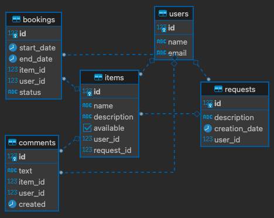

# ShareIt
### Описание приложения
Сервис позволяет бронировать вещи на определённые даты. 
У пользователей есть возможность оставлять запросы, по которому можно будет добавлять новые вещи для шеринга.
Доступны все CRUD операции с сущностями приложения.

### ER диаграмма

